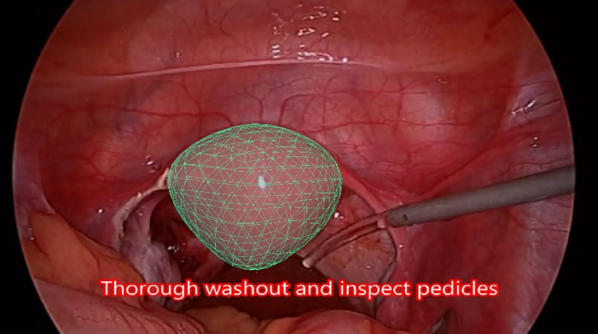

# Organ-Deformation-Tracking
Implementation of the method of dynamic binding and deformation of a 3D model of an organ from an endoscope video stream for surgical navigation tasks
## Problem
During endoscopic operations, it is necessary to ensure an accurate and
stable binding of the 3D model of the organ to the image of the organ on the video stream
coming from the endoscope. This is critically important for surgical navigation tasks,
especially considering:
- the movement of the camera (endoscope) itself
- mobility and deformity of the organ
- interactions with surgical instruments (contact, pressure, displacement
of tissues)

The initial frame for dynamic snapping and tracking:

## Initial data
- Video clip of endoscopic surgery:

- 3D model of the organ in OBJ format
- 3D scene: camera and organ matched by the first frame of the video (formats FBX, GLB)
- [Scientific publication: review of methods for tracking and deforming organs in the context of augmented reality](https://arxiv.org/abs/2408.02713)

## Task
- Implement a method for dynamically linking a 3D model to an organ in a video, taking
into account:
    - endoscope displacements and rotations
    - the movements of the organ itself
    - local deformation of the model in contact with a surgical instrument
- Provide visualization in the form of a video in which the 3D model of the organ is correctly
compared with the image throughout the operation

## Decision
